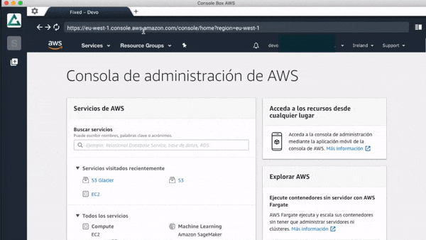

#   Console Box AWS 

***
Console Box AWS is an application that allows you to open different `AWS` sessions in the same window.

You create a workspace to work with an aws session and inside you have a full browser to navigate. You can create as many workspaces as you want.

***
## Example

 

***

## Behavior

The operation of the application is very simple, the ViewManager loads the root (ViewA or ViewB) based on the label `?view=viewB`.

ViewA contains the workspaces and ViewB contains the browser.

ViewB separates the sessions by the label `&session=${workSpace}`.

When you select a workspace in the ViewA, it creates a new process with the ViewB, separating the session.
Being a new process, it allows to have the browser open even if the workspace is changed to anther one.

**This application does not save any data of your aws passwords or names. Only save the cache and session like a normal browser do.***

***

## Available Scripts

* First install all node dependencies with yarn.


In the project directory, you can run:

### `yarn dev`

Runs the app in the development mode at [http://localhost:3000].<br>
Open [http://localhost:3000](http://localhost:3000) to view it in the browser.

Automatically switches between development and production.
**For production to work, you have to use the prebuild command**

```javascript
isDev? view.webContents.loadURL(`http://localhost:3000?view=viewB&session=${workSpace}`) : view.webContents.loadURL(`file://${path.join(remote.app.getAppPath(), `./build/index.html?view=viewB&session=${workSpace}`)}`);
```

The page will reload if you make edits.<br>
You will also see any lint errors in the console.


### `yarn prebuild-pack`

Builds the app for production to the `build` folder.<br>
It correctly bundles React in production mode and optimizes the build for the best performance.

The build is minified and the filenames include the hashes.<br>
Your app is ready to be packaged!

### `yarn dist-all`

Package and create the executables for windows and mac in the dist folder.

***

## Releases

Check here new [releases](https://github.com/DevopensourceTeam/Console_Box_AWS/releases)

***

## License
[MIT](https://github.com/DevopensourceTeam/Console_Box_AWS/blob/master/LICENSE)